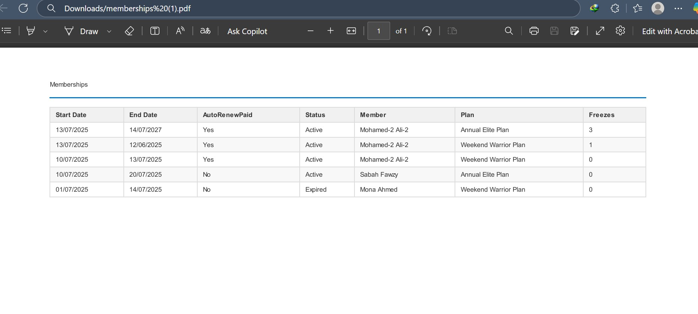

<!DOCTYPE html>
<html lang="en">
<head>
  <meta charset="UTF-8">
</head>
<body>

  <h1>🏋️‍♂️ Gym Management System</h1>
  
The system allows Admins to create subscription plans and assign memberships to members with defined limits. Trainers manage class sessions, while members can book sessions only if their membership is active and not frozen. Admins can freeze/unfreeze memberships, with automatic unfreeze handled by background jobs. The system includes booking validation, session limits, and automated reminders via Hangfire.

  <h3>🗺️ Entity Relationship Diagram (ERD)</h3>

  <h2>📦 Technologies & Packages</h2>
  <ul>
    <li><strong>.NET 9</strong> — Core framework</li>
    <li><strong>Entity Framework Core</strong> — ORM for SQL Server</li>
    <li><strong>ASP.NET Identity</strong> — Authentication & authorization</li>
    <li><strong>JWT</strong> — Token-based authentication</li>
    <li><strong>Serilog</strong> — Structured logging</li>
    <li><strong>Hangfire</strong> — Background task scheduler</li>
    <li><strong>FluentValidation</strong> — Input validation</li>
    <li><strong>Mapster</strong> — Lightweight object mapping</li>
    <li><strong>ClosedXML</strong> — Export Excel files</li>
    <li><strong>OpenHtmlToPdf</strong> — Generate PDF reports</li>
    <li><strong>HealthChecks UI</strong> — System health monitoring</li>
    <li><strong>System.Linq.Dynamic.Core</strong> — Dynamic filtering/sorting</li>
    <li><strong>Swashbuckle</strong> — Swagger UI for API documentation</li>
    <li><strong>Stripe.net</strong> — Payment integration</li>
    <li><strong>Data Protection API</strong> — Secure ID encryption</li>
  </ul>

  <h2>🔐 Security</h2>
  <ul>
    <li>Email confirmation</li>
    <li>JWT authentication</li>
    <li>Password reset workflow</li>
    <li>Role-based access control</li>
    <li>ID encryption for sensitive links (e.g., booking, profile)</li>
  </ul>

  <h2>📊 Core Features by Module</h2>

  <h3>1️⃣ Subscription Plan</h3>
  
Admins can create various subscription plans with different pricing, duration, and session limits.

  <ul>
    <li>CRUD for plans</li>
    <li>Duration-based validation</li>
    <li>Pricing management</li>
  </ul>
  

  <h3>2️⃣ Member Module</h3>
  
Manages gym members and their subscriptions.

  <ul>
    <li>Register new members</li>
    <li>View active subscriptions</li>
    <li>Reset password and update profile</li>
    <li>Token-based login</li>
  </ul>
  

  <h3>3️⃣ Role Management</h3>
  
Assign and manage roles like Admin, Trainer, and Staff.

  <ul>
    <li>Create, update, and delete roles</li>
    <li>Assign roles to users</li>
    <li>Used for authorization and UI access control</li>
  </ul>
  

  <h3>4️⃣ Auth Module</h3>
  
Authentication and user account management.

  <ul>
    <li>Login via JWT token</li>
    <li>Email confirmation</li>
    <li>Change/reset password</li>
    <li>Refresh tokens</li>
    <li>Token expiration handling</li>
  </ul>
  

  <h3>5️⃣ Trainer Module</h3>
  
Register, update, and assign trainers to sessions or programs.

  <ul>
    <li>Register trainer</li>
    <li>Update profile and schedule</li>
    <li>View assigned sessions</li>
  </ul>
  
  

  <h3>6️⃣ Class Session Module</h3>
  
Trainers or staff can create and manage gym class sessions.

  <ul>
    <li>Create session with time, trainer, capacity</li>
    <li>Show available classes for booking</li>
    <li>Filter by date, trainer, or availability</li>
  </ul>
  

  <h3>7️⃣ Booking Module</h3>
  
Members can book class sessions based on their subscription limits.

  <ul>
    <li>List available sessions</li>
    <li>Booking within allowed quota</li>
    <li>Prevent overbooking or double booking</li>
    <li>Encrypted ID used in links</li>
    <li>Cancel or modify bookings (if session not started)</li>
  </ul>
  
  <h3>💳 Stripe Integration</h3>

  The system integrates with <strong>Stripe</strong> to handle secure online payments.
  Members can pay for subscriptions via Stripe Checkout.

<ul>
  <li>Payment records store <code>SessionId</code>, <code>PaymentIntentId</code>, and <code>PaymentStatus</code></li>
  <li>Each payment is linked to both the <strong>Member</strong> and their <strong>Membership</strong></li>
</ul>

  Admins can review all payments and assign memberships upon successful payment confirmation.

 
  <h3>8️⃣ Dashboard Module</h3>
  
Admin and staff can view summarized system statistics.

  <ul>
    <li>Total members, trainers, sessions</li>
    <li>Memberships per day/week/month</li>
    <li>Top booked classes</li>
    <li>Upcoming sessions</li>
    <li>Expiring memberships</li>
  </ul>
  
 
  <h3>9️⃣ Background Tasks</h3>
  
Scheduled jobs using Hangfire for:

  <ul>
    <li>Sending reminders for expiring memberships</li>
    <li>Class session reminders to members</li>
    <li>Weekly trainer/session reports</li>
  </ul>
  
  

  <h3>🔟 PDF & Excel Reports</h3>
  
Generate reports for auditing or exporting data.

  <ul>
    <li>Download member list</li>
    <li>Session report with bookings</li>
    <li>Trainer assignments</li>
  </ul>
  
  
  <h3>9️⃣ Roles Management Module</h3>

Manages application roles used for access control and user permissions.

<ul>
  <li><strong>Create:</strong> Add new roles (e.g., Admin, Trainer, Staff)</li>
  <li><strong>Read:</strong> Retrieve a list of all roles or a single role by ID</li>
  <li><strong>Update:</strong> Edit existing role details (name,  etc.)</li>
</ul>

This module is essential for securing and organizing access across the system's features.

 
 <h3>🔐 Account Management Module</h3>

Allows users to manage their personal account settings securely.

<ul>
  <li><strong>View Account:</strong> Retrieve current user profile and details (e.g., name, email, role)</li>
  <li><strong>Update Profile:</strong> Edit user information like name or contact details</li>
  <li><strong>Change Password:</strong> Securely update password using current credentials</li>
</ul>

This module ensures each user can manage their own identity while maintaining data privacy and security.

 
 <h3>👤 User Management (Admin)</h3>

Admins can manage users across the system to ensure security and accessibility.

<ul>
  <li><strong>Unlock User:</strong> Admins can manually unlock a user's account if it's been locked due to multiple failed login attempts or security reasons.</li>
</ul>

This helps administrators maintain control over user access and recover locked accounts when needed.

  <h3>🧭 Pagination, Filtering, and Sorting</h3>
  <ul>
    <li>Paginated endpoints</li>
    <li>Dynamic filtering and searching</li>
    <li>Multi-field sorting (e.g., date, name, capacity)</li>
  </ul>
<h3>⚙️ Performance & Security Enhancements</h3>

<ul>
  <li>
    <strong>In-Memory Caching:</strong>
    The application uses <code>IMemoryCache</code> to improve performance by caching frequently accessed data such as plans, settings, or role lists.
  </li>
  <li>
    <strong>Rate Limiting:</strong>
    Built-in rate limiting is applied to API endpoints to protect the system from abuse and ensure fair usage. This helps mitigate brute-force attacks and overuse.
  </li>
</ul>

  <h3>🔧 Health Check & Logging</h3>
  <ul>
    <li>Database health, disk space, API uptime</li>
    <li>Logs structured with Serilog</li>
  </ul>
 <h2>📘 Business Workflow: From Subscription Plan to Booking</h2>

<h3>1️⃣ Admin: Subscription & Membership</h3>
<ul>
  <li>Admin creates one or more <strong>Subscription Plans</strong> (e.g., Basic, Premium).</li>
  <li>Admin pays for the selected plan on behalf of the member.</li>
 <li>After paying for the plan, <strong>Admin adds the Membership</strong> for the member. The member cannot create memberships on their own.</li>
  <li>Membership is linked to the plan and includes usage limits (e.g., number of classes, duration).</li>
</ul>

<h3>2️⃣ Trainer: Class Creation</h3>
<ul>
  <li><strong>Trainer</strong> can create <strong>Class Sessions</strong> (title, time, max capacity, etc.).</li>
</ul>

<h3>3️⃣ Member: Booking Flow</h3>
<ul>
  <li>Member logs in with <strong>JWT authentication</strong>.</li>
  <li>System lists only sessions they are eligible for.</li>
  <li>To book a class, the system checks:</li>
  <ul>
    <li>✔️ Membership is <strong>active</strong> (not frozen or expired).</li>
    <li>✔️ <strong>Remaining allowed sessions</strong> (e.g., 8 of 12 used).</li>
    <li>✔️ Class is not <strong>full</strong>.</li>
    <li>✔️ Member hasn't already booked the session.</li>
  </ul>
  <li>If all checks pass, the booking is stored and confirmation is returned.</li>
</ul>

<h3>4️⃣ Membership Freeze</h3>
<ul>
  <li>Member can request to <strong>freeze</strong> their membership (pause access).</li>
  <li>Admin can also <strong>freeze/unfreeze</strong> manually.</li>
  <li>If frozen, member cannot book classes.</li>
  <li>After the freeze duration ends, the membership is <strong>automatically unfrozen</strong>.</li>
  <li><strong>Hangfire background jobs</strong> monitor and perform the auto-unfreeze action.</li>
</ul>

<h3>5️⃣ Background Jobs & Notifications</h3>
<ul>
  <li><strong>Hangfire</strong> sends automatic reminders before class times.</li>
  <li>Other jobs can notify users of <strong>upcoming sessions</strong> or <strong>expiring memberships</strong>.</li>
</ul>

</body>
</html>
